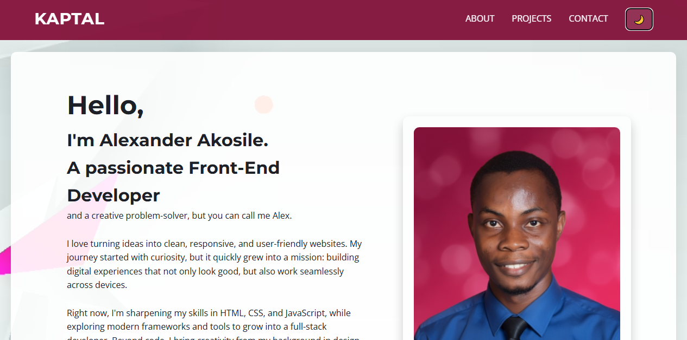

# KAPTAL | Portfolio

This is my personal **portfolio website**, built with **HTML5, CSS3, and JavaScript**.  
It showcases my journey as a Front-End Developer, featuring:  

- Responsive design (desktop, tablet, mobile)  
- Dark/Light theme toggle  
- Hamburger menu for mobile navigation  
- Project showcase with live demo links  
- Contact form (Formspree integration)  

---

# Features

Responsive Layout
- Adjusts seamlessly for desktop, tablet, and mobile devices.  

Dark Mode
- Toggle between light and dark themes.  
- User preference is **saved** in the browser (localStorage).  

Mobile Navigation
- Hamburger menu on small screens.  
- Smooth slide-down animation for nav links.  

Projects
- **[BudKonnect Landing Page](https://kapteynalexis.github.io/budKonnect-landing-page/)**  
- **[Dev-am Landing Page](https://kapteynalexis.github.io/dev-am-landing-page/)**  

---

Built With
- **HTML5**  
- **CSS3** (Flexbox, Media Queries, Transitions)  
- **JavaScript (Vanilla JS)**  

---

Contact
If you'd like to get in touch:  
- Email: alexakosile1@gmail.com

---

© 2025 KAPTAL. All rights reserved.  
Designed and developed by **Alexander Akosile**.
